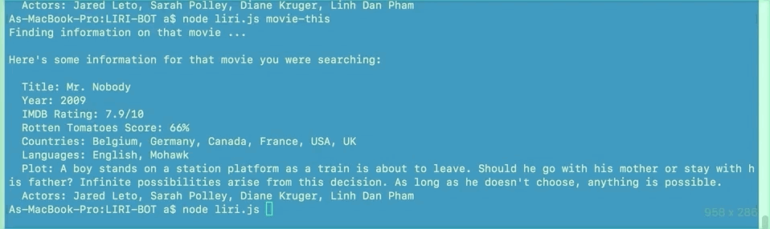

# LIRI-BOT
___________________________________________________________________________________________________________________

L.I.R.I. stands for Language Interpretation and Recognition Interface. It is a command line node app that takes in parameters and gives back data from various APIs.

LIRI is controlled through written text.

The LIRI app uses Node.js in the command line of your computer and has dependencies for the request, spotify, and twitter Node packages. It also used the built-in fs package to read and write to text files.

The app features 4 different features using the node liri.js [command-here] syntax. Below are the command types...

`my-tweets` returns your Twitter account's 20 most recent tweets using the Twitter API.
`spotify-this-song [song-title-here]` returns the artist, album, and preview URL for a specific song using the Spotify API.
`movie-this [movie-title-here]` returns the year, rating, plot summary, reviews of a specific movie using the IMDb API.
`do-what-it-says` returns the result of a "random" result by reading the random.txt file and performing the command written in that file.       This command can be changed to any one of the 3 types listed above.

## Instructions
__________________________________________________________________________
Unfortunately, since this is a command line application, it must be cloned down to your machine to be demoed. After cloning down the repo to your computer, `cd` into the `liri-bot` folder and run `npm install` to download all the node dependencies mentioned above.

After the node packages, are installed...

You will need to set up the Twitter API (if you do not wish to demo the `my-tweets` command, you can skip this part)
You will need to get API keys for Twitter. Please refer to the Twitter Apps page to get a `consumer_key`, `consumer_secret`, `access_token_key`, and `access_token_secret`. You can also see the npm page for more information.
After you get the API keys, open the `keys.js` file and paste them into the correpsonding locations in the `exports.twitter` object.
Finally, you can open the `liri.js` file and change the `myTwitterUserName:` to your twitter handle.
Note that the Spotify API and IMDb do not need special keys, so you can run the app with minimal setup if you wish to skip over the Twitter API functionality.
To run the app, simply use the `node liri.js [command-here]` format discussed above. Please refer to the screenshots for specific examples. Be sure that you `cd` into the `liri-bot` folder before running the commands.

## Screenshots
____________________________________________________________________________________________
### Twitter API

Running the command `node liri.js my-tweets` will return my 8 most recent tweets. Twitter Command

### Spotify API

Running the command `node liri.js spotify-this-song <'song name'>` will return the track info from Spotify. Spotify Command

If no song name is given, will return suggested song. 

### IMDb API

Running the command `node liri.js movie-this <'movie name'>` will return the movie info from OMDb. 

If no movie name is given, will return suggested movie. 

### Node fs file reader

Running the command `node liri.js do-what-it-says` will read a command out of the `random.txt` file and perform it. 
Note that in this case, the `random.txt` file contians the command to Spotify the song "I Want It That Way". The `random.txt` file can be changed to perform any of the 3 types of commands listed above.

### Error Handling

If the LIRI inputs are incomplete, the user will be prompted with a list of possible commands. 